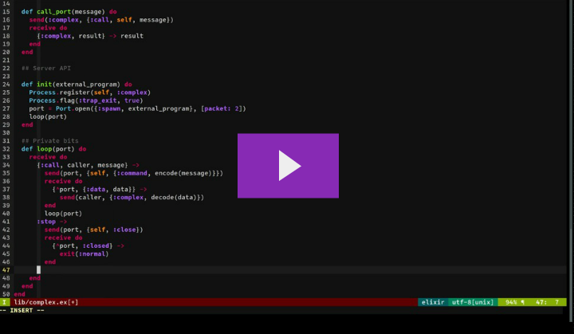

Complex
=======

Example of ports as in http://erlang.org/doc/tutorial/c_port.html.  This is an
[ElixirSips](http://elixirsips.com) episode (194), and below you'll find the
video and the script for the episode.  Just playing around with fun stuff :)

[](http://elixirsips.com/episodes/194_interoperability_ports.html)

## Episode 194: Interoperability - Ports

You will eventually want to interoperate with another system.  We've already
played a little bit with ports, but this is an example of writing a C port that
can talk directly to your Elixir system.  For now, I'm mostly just going to
rebuild what is in the Erlang tutorial for ports, but with Elixir in mind.

### Project

We'll start a new project:

```sh
mix new complex
cd complex
```

```sh
vim lib/complex.ex
```

OK, so now it's worth talking a little bit about how ports work.  Basically, we
spin up a process inside our operating system and we send and receive messages
with that process using ports.  We've done this before with existing UNIX
programs using standard in and standard out, but now we're going to do it with a
custom protocol.

```elixir
defmodule Complex do
  def start(external_program) do
    spawn(__MODULE__, :init, [external_program])
  end
end
```

OK, so we're going to call start with a string that represents an external
program to run, and this will spawn a process that calls this module's `init`
function with that argument.  Nothing weird is happening yet.

```elixir
defmodule Complex do
  #...
  def init(external_program) do
    Process.register(self, :complex)
    Process.flag(:trap_exit, true)
    port = Port.open({:spawn, external_program}, [packet: 2])
    loop(port)
  end
end
```

Now the init function just registers this process as the atom `complex` and says
it wants to trap exits.  Then it opens up a port.  This port spawns an external
program, which is the binary whose name is the string we passed in to 'start'.
We'll use a 2 byte length indicator to communicate between the two systems.  The
Erlang VM will automatically add this indicator when it's talking to the C
program, but we'll have to handle this bit explicitly from the C side.

Finally, we just loop on the port we opened.

Now, before we move on I want to show you the C code that we'll be calling out
to.  It's intentionally simple, and again this is just the example used in the
erlang user's guide for the C Port tutorial.  We support 2 functions, `foo` and
`bar`.  I think you can understand the C code even if you aren't a whiz with C.

```sh
mkdir src
vim src/complex.c
```

```c
/* complex.c */

int foo(int x) {
  return x+1;
}

int bar(int y) {
  return y*2;
}
```

Alright, so you've got that to keep in mind as what we're integrating with.


Next, we'll implement the Elixir side of our API.  We'll provide 2 functions,
`foo` and `bar`, that take an integer argument and pass it on to the port,
returning whatever it returns.

```elixir
defmodule Complex do
  #...
  def foo(x) do
    call_port({:foo, x})
  end

  def bar(y) do
    call_port({:bar, y})
  end
end
```

Then comes `call_port`:

```elixir
defmodule Complex do
  #...
  def call_port(message) do
    send(:complex, {:call, self, message})
    receive do
      {:complex, result} -> result
    end
  end
end
```

This just sends a 3-tuple to the Elixir process we spawned and registered under
the name `complex`.  The second element in the 3-tuple is our pid.  It then
blocks until our process receives a message that matches the 2-tuple pattern.
Finally, it returns the result when it receives it.

Now we can get to the loop itself.

```elixir
defmodule Complex do
  #...
  def loop(port) do
    receive do
      {:call, caller, message} ->
        send(port, {self, {:command, encode(message)}})
        receive do
          {^port, {:data, data}} ->
            send(caller, {:complex, decode(data)})
        end
        loop(port)
    end
  end
```

OK, so this is the core piece that wires this process together with the port.
If we receive a message that tells us to make a call, we send the port a
2-tuple.  The first element is our pid, and the second is a 2-tuple whose first
element is the atom `command` and whose second element is the message, encoded.
We then block to receive data from the port.  This is sent as a 2-tuple whose
first element is the atom `data`, inside a 2-tuple whose first element is the
port we opened, so we can be sure the message is coming from where we're
expecting it to come from.  Once we've received this message from the port, we
send the caller the result, decoding it on the way out.  The elixir component
that used our API will just deal with nicely formatted elixir data, and all of
the encoding and decoding lives in this piece of code.

Now that I've talked through all of that, we're going to add a couple of things
that allow us to explicitly stop the port or handle a crash from the C code
moderately gracefully:


```elixir
defmodule Complex do
  #...
  def loop(port) do
    receive do
      {:call, caller, message} ->
        send(port, {self, {:command, encode(message)}})
        receive do
          {^port, {:data, data}} ->
            send(caller, {:complex, decode(data)})
        end
        loop(port)
      :stop ->
        send(port, {self, :close})
        receive do
          {^port, :closed} ->
            exit(:normal)
        end
      {'EXIT', ^port, _reason} ->
        exit(:port_terminated)
    end
  end
```

Now all that's left is to define the `encode` and `decode` functions.

```elixir
defmodule Complex do
  #...
  # OK so we'll encode the 'foo' command as 1, and the 'bar' command as 2.  It's
  # important to realize we're going to be sending raw bytes here, so this is
  # the bit of the code that will break down for values greater than 255.
  def encode({:foo, x}), do: [1, x]
  def encode({:bar, y}), do: [2, y]

  # We'll decode messages that come back - they're just a list of 1 byte, and we
  # want to treat that like the integer that it is in this case.
  def decode([int]), do: int
end
```

Finally we'll add the `stop` function that tells the process to close the port,
which we've already supported in the loop:

```elixir
  def stop do
    send(:complex, :stop)
  end
```

Alright, all that code put together looks like this:

```elixir
defmodule Complex do
  def start(external_program) do
    spawn(__MODULE__, :init, [external_program])
  end

  def stop do
    send(:complex, :stop)
  end

  def foo(x) do
    call_port({:foo, x})
  end

  def bar(y) do
    call_port({:bar, y})
  end

  def init(external_program) do
    Process.register(self, :complex)
    Process.flag(:trap_exit, true)
    port = Port.open({:spawn, external_program}, [packet: 2])
    loop(port)
  end


  def call_port(message) do
    send(:complex, {:call, self, message})
    receive do
      {:complex, result} -> result
    end
  end

  def loop(port) do
    receive do
      {:call, caller, message} ->
        send(port, {self, {:command, encode(message)}})
        receive do
          {^port, {:data, data}} ->
            send(caller, {:complex, decode(data)})
        end
        loop(port)
      :stop ->
        send(port, {self, :close})
        receive do
          {^port, :closed} ->
            exit(:normal)
        end
      {'EXIT', ^port, _reason} ->
        exit(:port_terminated)
    end
  end

  def encode({:foo, x}), do: [1, x]
  def encode({:bar, y}), do: [2, y]

  def decode([int]), do: int
end
```

Now we've defined a couple of C functions but that's not enough to actually
communicate with our system here - there's no concept of dealing with standard
in and standard out, which is what we're going to use to wire these things
together.  For this, we have a couple of utilities that are also provided in the
erlang interoperability tutorial.  We'll talk through them fairly quickly:

```sh
vim src/erl_comm.c
```

```c
/* erl_comm.c */

typedef unsigned char byte;

read_cmd(byte *buf)
{
  int len;

  // if we can't read 2 bytes we freak out
  if (read_exact(buf, 2) != 2)
    return(-1);
  // those 2 bytes tell us how long this message is.  We then read the message
  // This is the bit where I said the elixir side has it easy but the c code has
  // to be explicit.
  len = (buf[0] << 8) | buf[1];
  return read_exact(buf, len);
}

// when we write a message out, we write the 2 byte length indicator
// as well, so that the erlang program's knowledge that we're using
// 2 byte length indicators is satisfied.
write_cmd(byte *buf, int len)
{
  byte li;

  li = (len >> 8) & 0xff;
  write_exact(&li, 1);

  li = len & 0xff;
  write_exact(&li, 1);

  return write_exact(buf, len);
}

// This is just a function to read a certain number of bytes into a buffer from
// standard input (0)
read_exact(byte *buf, int len)
{
  int i, got=0;

  do {
    if ((i = read(0, buf+got, len-got)) <= 0)
      return(i);
    got += i;
  } while (got<len);

  return(len);
}

// and this is a function to write a certain number of bytes from a buffer to
// standard output (1)
write_exact(byte *buf, int len)
{
  int i, wrote = 0;

  do {
    if ((i = write(1, buf+wrote, len-wrote)) <= 0)
      return (i);
    wrote += i;
  } while (wrote<len);

  return (len);
}
```

OK, so that's the general communication protocol between C and Elixir.  Next, we
will make the file that actually specifies the port - this is the piece that
wires the communication piece with our functional specification of the foo and
bar functions:

```sh
vim src/port.c
```

```c
/* port.c */

typedef unsigned char byte;

int main() {
  int fn, arg, res;
  byte buf[100];

  // We just read commands from standard input as long as we can...
  while (read_cmd(buf) > 0) {
    // Once we've gotten a command, we know the function is determined by the
    // first byte and its argument is the second byte
    fn = buf[0];
    arg = buf[1];

    if (fn == 1) {
      // We said that 1 was foo
      res = foo(arg);
    } else if (fn == 2) {
      // and 2 was bar
      res = bar(arg);
    }

    // We set the response value in the first byte of our buffer
    buf[0] = res;
    // and we write that byte back to the elixir program over standard out
    write_cmd(buf, 1);
  }
}
```

OK, so that's the whole shebang.  But does it work?  We can build it with gcc:

```sh
mkdir priv
gcc -o priv/extprg src/complex.c src/erl_comm.c src/port.c
```

That will output it to the priv directory as a file named "extprg".  We can then
spin up iex and try it out:

```sh
iex -S mix
```

```
Complex.start("priv/extprg")
Complex.foo(1)
Complex.bar(5)
```

And since we know that this is using 1 byte for communicating the result, we can
do terrible things like send a valid command that cannot possibly receive a
valid response!

```
Complex.foo(255)
```

Right, so foo increments by 1.  But then we get a single byte.  So this
is...right...sort of.  Ditto for bar:

```
Complex.bar(128)
```

And of course if we try to call a function with an integer that can't be
represented by a single byte, bad things will happen:

```
iex(5)> Complex.foo(256)

19:59:08.259 [error] Bad value on output port 'priv/extprg'
```

Hey look we crashed everything!  Don't make your port return a value that's
outside of the range of acceptable values you specified when spawning it!

If we start back up, we can see the program is running with ps:

((( do it )))
((( then in a new terminal tab )))

```sh
ps ax|grep extprg
```

Now if we tell the module to stop the port, this OS process will go away:

```
Complex.stop
```

```sh
ps ax|grep extprg
```

### Summary

Anyway, that's it.  Today we saw how you can build a C program to interoperate
with your Elixir system, and we saw how you can make things go horribly wrong if
you say it'll operate in one particular way and it doesn't, with respect to
sending back 1 byte responses.  I have personally used this facility to have
erlang manage some C code that was using opencv to resize images, because
writing a webserver in C to front for that function was pretty horrible.  I hope
you enjoyed it - see you soon!

### Resources

- [Erlang Tutorial on C ports](http://erlang.org/doc/tutorial/c_port.html)
